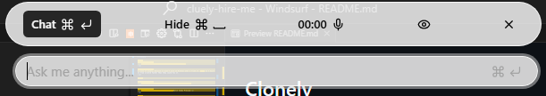

# Clonely

<br />
<p align="center">
    
</p>

<p align="center">
A clone of Cluely, because it didn't work on Windows when I tried it. <br/> So I built it from scratch faster than they could fix it.
</p>

<br />

<p align="center">
    
</p>

<p align="center">
    <a href="https://www.loom.com/share/2ad168adb3844543a45437b184bc822b">Watch Demo 1</a> <br>
    <a href="https://www.loom.com/share/c98eaf60366548bf94cf2312f8ed704d?sid=3d2e2395-08af-4d9b-aa62-cccefd63a3be">Watch Demo 2</a>
</p>

<br />

### Features

- 🕵️‍♂️ Invisible to screen capture tools
- 👀 Can see your screen
- 🎤 Can hear you alongside your device, including others in meetings (this is a good thing)
- 🔄 Two modes: chat, voice. Both have access to your screen
- ⌨️ Shortcut enabled: quickly hide with <kbd>Ctrl</kbd>+<kbd>Space</kbd>

<br />

### Work in Progress

- 🛠️ Improve model behaviour using system prompts
- 📦 Ship a standalone .exe

<br />

### Limitations

- 🤖 Currently only interfaces with Gemini
- 🪟 Aimed at Windows; unsure how it will perform on macOS, Linux

<br />

## Prerequisites

- Node.js (v18 or higher)
- npm, yarn, pnpm, or bun

<br />

## Installation

Clone the repository and install dependencies:

```bash
# Clone the repository

# Install dependencies
npm install
```

<br />

## Development

Set your Gemini API key in the .env file:

```bash
VITE_GEMINI_API_KEY=*****
```

Start the development server:

```bash
npm run dev
```

This will start Clonely with hot-reload enabled so you can see changes in real time.

<br />

## Building for Production

Build the application for your platform:

```bash
# For Windows
npm run build:win

# For macOS
npm run build:mac

# For Linux
npm run build:linux

# Unpacked for all platforms
npm run build:unpack
```

Distribution files will be located in the `dist` directory.

<br />
